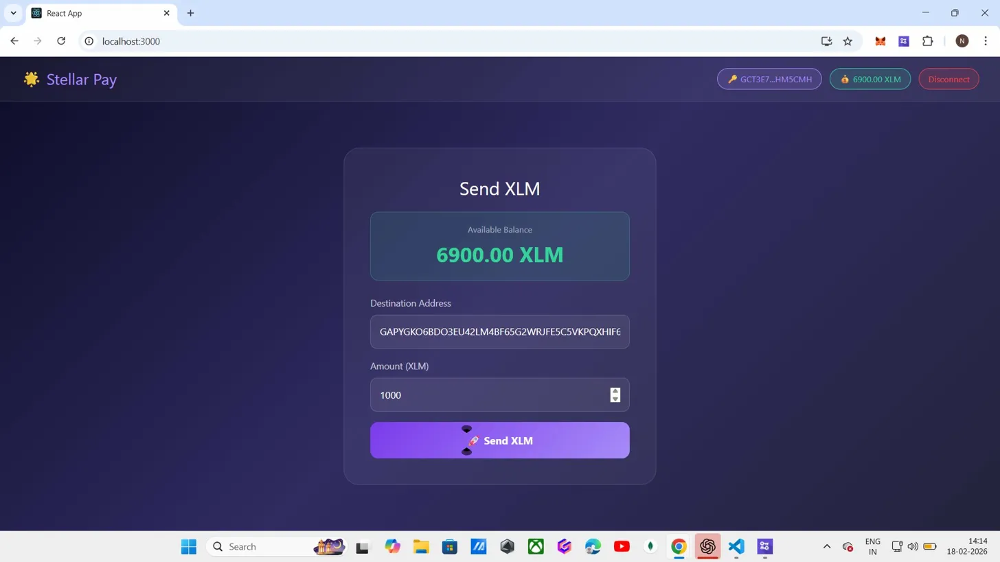
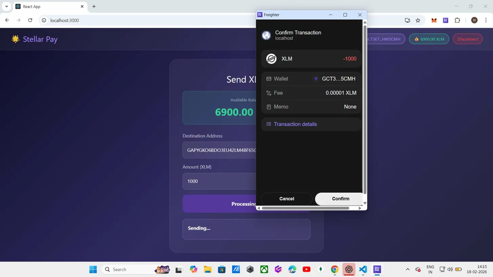
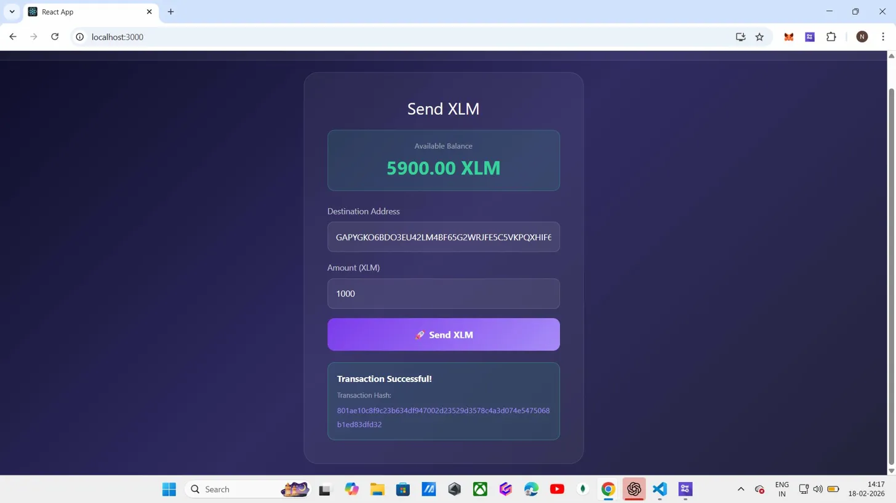

# 🌟 Stellar Pay - Simple Payment dApp

A decentralized payment application built on the Stellar testnet that allows users to connect their Freighter wallet and send XLM transactions.

## 📋 Project Description

Stellar Pay is a simple payment dApp built with React and the Stellar SDK. Users can connect their Freighter wallet, view their XLM balance, and send XLM to any Stellar testnet address with real-time transaction feedback.

### Features
- 🔗 Connect / Disconnect Freighter wallet
- 💰 Display real-time XLM balance
- 🚀 Send XLM to any Stellar testnet address
- ✅ Transaction success / failure feedback
- 🔍 Transaction hash with link to Stellar Expert Explorer

## 🛠️ Setup Instructions

### Prerequisites
- [Node.js](https://nodejs.org/) installed
- [Freighter Wallet](https://www.freighter.app/) browser extension installed
- A funded Stellar testnet account via [Stellar Friendbot](https://friendbot.stellar.org/)

### Installation

1. Clone the repository:
```bash
git clone https://github.com/YOUR_USERNAME/YOUR_REPO_NAME.git
cd YOUR_REPO_NAME
```

2. Install dependencies:
```bash
npm install
```

3. Start the development server:
```bash
npm start
```

4. Open [http://localhost:3000](http://localhost:3000) in your browser.

### Freighter Wallet Setup
1. Install the [Freighter extension](https://www.freighter.app/)
2. Create or import a wallet
3. Switch to **Testnet** in Freighter settings
4. Fund your wallet at [https://friendbot.stellar.org](https://friendbot.stellar.org/)

## 📸 Screenshots

### Wallet Connected + Balance Displayed


### Freighter Transaction Confirmation


### Successful Transaction Result


## 🔧 Tech Stack
- React.js
- Stellar SDK
- Freighter API
- Stellar Testnet (Horizon)